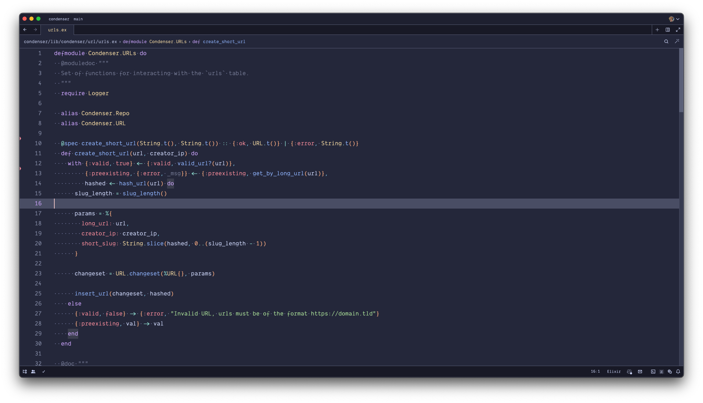

# zed-themes
A collection of imported VSCode themes to Zed.

**NOTE: The themes in this repo are no longer maintained, instead they've been moved to official zed extensions and the raw configs can be found at:**
- [Catppuccin](https://github.com/ssaunderss/zed-catppuccin)
- [Nightfox](https://github.com/ssaunderss/zed-nightfox)
- [Tokyo Night](https://github.com/ssaunderss/zed-tokyo-night)

If you want to quickly load these themes you can use the following command:
```bash
sudo find ~/repo/zed-themes/ -type f \( -iname '*.json' \) -exec cp {} ~/.config/zed/themes \;
```

## Catppuccin

### Macchiato


### Latte


### Mocha


### Frappe


## Nightfox

### Carbonfox


### Duskfox


### Nightfox


### Nordfox


### Terafox


## Tokyo Night

### Tokyo Night Light


### Tokyo Night Storm


### Tokyo Night

